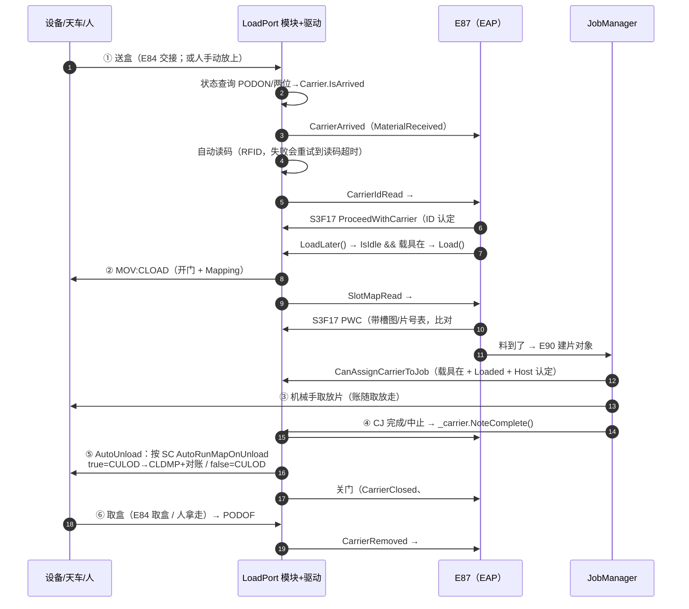
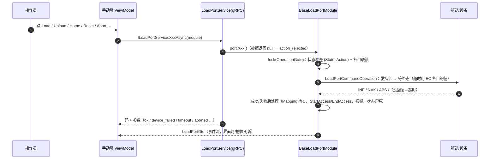
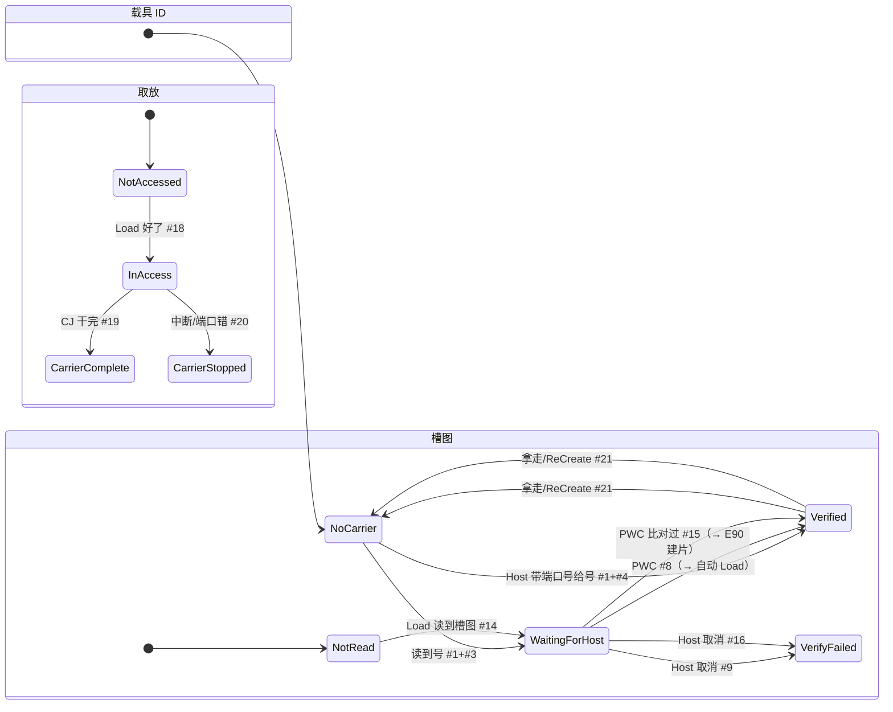

# LoadPort 手动 / 自动 / EAP 流程讲解（对着当前代码）

- 日期：2026-10-10
- 代码：`D:\Common`（xyz.Framework）
- 涉及：`xyz.Modules\Loadport\**`、`xyz.Modules\E84\**`、`xyz.Drivers\Loadport\**`、`xyz.Components\Components\Drivers\**`、`Eap\E87\**`、`xyz.Service\LoadPortService.cs`、`xyz.Modules\Job\**`

---

## 0. 先分清三个"自动 / 手动"（最容易混）

| 名字 | 是什么 | 在哪 | 影响 |
|---|---|---|---|
| **设备总状态 Auto/Manual** | 整机"自动跑货 / 手动"，决定自动派单 | `EquipmentStatusPublisher.IsAuto`、`JobManager.IsAuto` | 只影响 Job 调度，不影响 LoadPort 动作 |
| **LoadPort 的 Auto/Manual（IsAutoMode）** | 端口的存取方式：Auto = 搬运车经 E84 自动交接，Manual = 人工放取 | `BaseLoadPortModule.IsAutoMode`，手动页 / S3F25 / S3F27 都能改 | E84 开不开闸门；E87 的 PortAccessMode 报给 Host |
| **动作来源：自动 / 手动** | 谁发起这个动作：E87 / Job 自动发，还是操作员在手动页点 | 见下面第 2、3 节 | 只有 **Unload** 分两套口径（`Unload()` vs `UnloadManually()`） |

> 注意：`IsAutoMode` 不是"整机是否在跑货"，它是这个端口跟天车交不交接。

---

## 1. 组件与线程模型

```
┌──────────────────────────────── 客户端 ────────────────────────────────┐
│  主界面（LoadPort 页签 / 调度图 / Job 创建）     手动页 LoadPortManualControl │
│            │ gRPC IJobService                     │ gRPC ILoadPortService    │
└────────────┼──────────────────────────────────────┼─────────────────────────┘
             ▼                                      ▼
┌────────────────────────── xyz.Service ────────────────────────────────────┐
│  JobService / SequenceService …          LoadPortService（手动命令 → 模块） │
└──────────────────────────────────────────────┬────────────────────────────┘
                                               ▼
┌─────────────────────── 模块层 BaseLoadPortModule ─────────────────────────┐
│  扫描线程（ComponentBase.ScanLoop，50ms 一拍，OnScan 递归子组件）：          │
│    ① LoopQueryStatus  每拍 GET:STATE，超时作废重发（EC QueryDataTimeOut）   │
│    ② Carrier.Sense(在位/到位)  ③ StepE84 推一拍  ④ CheckDeviceAlarm        │
│    ⑤ CheckAutoUnload（Job 干完自动卸）  ⑥ PublishState（事件流推界面）      │
│  动作：Begin(动作) → 状态表 LoadPortStateTable + 联锁 → LoadPortCommandOperation│
├──────────────┬──────────────────────────┬────────────────────────────────┤
│CarrierComponent│LoadPortDriverComponent │ E84Component                    │
│载具/读码/槽图/账│FCD 指令 + 帧路由 + 重连  │ PIO 握手（TP1~TP5/光幕/ES）      │
└──────┬───────┴────────────┬─────────────┴────────────────────────────────┘
       │ IE87Callback        │ E87Callback/E84Provider 由 EAP 挂
┌──────▼─────────────────────▼──────────────────────────────────────────────┐
│ EAP：EapComponent → E30(GEM)/E39/E87/E90/E40/E94 + Hsms + Notifier         │
│      E87Component：每端口一个 E87Port + 6 个状态机，EC PortPollMs 轮询状态   │
└───────────────────────────────────────────────────────────────────────────┘
```

驱动侧：发送走 Channel 串行队列，回复在“帧路由”任务上按指令名认领；模块在扫描线程只**轮询** `IsCompleted`，不等（`LoadPortDriverBase`、`LoadPortCommandOperation`）。

---

## 2. 自动流程（AutoRun）

### 2.1 一次完整自动跑货



### 2.2 分步对代码

**① 盒子放上（两种来源）**
- E84 交接：`E84Component.Step`（TP1~TP5、光幕、ES），完成时报 `E84Report.Completed`；
- 人放上（Manual 端口）：状态查询两位都亮，或设备主动报到 `PODON`。
- 判定在 `CarrierComponent.Sense/Judge`：`Query` 看状态查询两位（都亮=放好、都灭=拿走、一亮一灭不算变化），`Event` 只看 `PODON/PODOF`；结果写 `Carrier.IsArrived`，变化时 `Arrive()/Remove()`。

**② 读码**
- `CarrierComponent.Arrive()` → `AutoReadCarrierId=true` 时 `StartAutoRead()`；没发起成功（读头断线/忙）每拍重试，到 `EC ReadCarrierIdTimeout` 按读码失败上报。结果在 `OnScan → TakeReadResult`。
- 读码成功 → `NotifyE87(CarrierIdRead)` → E87 建载具对象（#1）、进“等 Host”（#3）。

**③ Host 认定 ID → 自动 Load**
- `E87CarrierIdStateMachine.EnterVerified`：报 #4/#8 → `_carrier.SetId(...)` → `E87Port.LoadLater()`；
- `LoadLater` 在锁外做：`device.IsIdle && carrier.IsArrived` 才 `port.Load()`，不然记一条警告等操作员。
- **没接 EAP 时没有这一步**：`E87Callback` 为 null，Load 由操作员在手动页点，或机型自己重写。

**④ Load 动作本体（自动 / 手动同一条）**
- `BaseLoadPortModule.Load()` → `Begin(Load)`：状态表要求 `Idle → Loading → Loaded`，联锁 `LoadInterlock()`（默认要载具到位）；
- `LoadPortCommandOperation`：`_driver.Load()`（FCD `MOV:CLOAD`，开门 + Mapping）→ 等终态 → 成功回调 `TakeSlotMap()`：
  - 槽数 ≠ SC `SlotCount` → **不落账**、判失败（`slot_map_length_mismatch`）、报 Mapping 异常；
  - 有交叉/叠片/认不出 → 账照落（界面看得到）、判失败（`slot_map_abnormal`）；
  - 正常 → `Carrier.UpdateSlotMap()`：更新槽图、**整篮重建晶圆账**、报 E87 `SlotMapRead`。
- 失败（超时/设备 NAK）→ `OnOperationCompleted`：作废在途指令、`MarkAccessStopped`、报 E87 `PortError`、报警、端口落 Error。

**⑤ 槽图跟 Host 核对 → "料到了"**
- `E87SlotMapStateMachine`：`NotRead → WaitingForHost(#14) → Verified(#15)`；
- 第二次 `S3F17 ProceedWithCarrier` 带槽图：跟设备读到的一致才收，片号表写进晶圆账；认定后 `NotifyMaterialVerifiedLater` 通知 **E90 建片对象**。
- 之后 `Carrier.IsAccepted = true`，`CanAssignCarrierToJob`（Job 定片/建 CJ）和 `CanPrepare`（机械手进站）才放行。

**⑥ 跑货（Job 侧，不在 LoadPort 里）**
- `JobManager` 建 PJ/CJ → 任务表（一片一行）→ `TransferManager` → 机械手 `Pick/Place` 改晶圆账；
- CJ 完成或中止收尾时：`JobManager.OnControlJobStateChanged` → `LoadPort(job.LoadPort)?._carrier.NoteComplete()` → `AccessStatus=Complete`、报 E87 `CarrierComplete`（#19）。

**⑦ 自动卸载（AutoUnload）**
- 端口每拍 `CheckAutoUnload()`：
  - 只在 `AutoUnload=true` 且**刚变成 Complete 那一下**记要卸（之后人又手动 Load 起来不再卸）；
  - 等机械手回 `Loaded`；
  - **从这个口取出去、还在腔体/机械手上的片没回齐就先不卸**（`CountWafersOutside`，Job 中止会有）；
  - 满足才 `Unload()`。
- `Unload()`（自动跑货口径）：
  - SC `AutoRunMapOnUnload = true` → 先 `MOV:CULOD` 关门，关好再 `MOV:CLDMP` 主动扫一遍（FCD 没有带图卸载的指令，两条串在同一个 Unload 动作里：关门没成不扫，扫图没成判失败）→ `CheckUnloadSlotMap()` 逐槽跟晶圆账 `Verify`，对不上判失败 + `SlotMapAlarm` + 端口 Error，**盒子不能就这么被取走**；
  - `= false` → `MOV:CULOD`（直接关门，不扫不对账）。
- 成功 → `Carrier.EndAccess()`（取放过没判完成记中断）+ 报 E87 `UnloadCompleted`（关门事件）；端口空闲后搬运状态转 **ReadyToUnload（等取）**。

**⑧ 取盒**
- E84 取盒（`U_REQ`）或人拿走 → `PODOF` → `Carrier.Remove()`：清载具对象、槽图，**清这个端口的晶圆账** → E87 `CarrierRemoved` → #21 删对象 + MaterialRemoved。
- `E87Port.Released` 复位，等下一盒。

### 2.3 E84 交接与"意外放取"
- 开闸条件（`E84Component.GateClosedReason`）：EC `E84Enabled`、端口 `IsAutoMode`、搬运状态不是 OutOfService、光幕没被挡；
- Auto 模式下**没走交接**载具被放上/拿走 → `UnexpectedCarrierAlarm`（只报警，不锁交接）；
- E84 超时（TP1~TP5）→ 输出全灭 + 锁存 + 报警，等人工 `Retry()` / `Complete(carrierPlaced)`；
- 接 EAP 时，交接方向由 `IE84Provider.GetTransferState` 决定（E87 的 `TransferMachine.Compute()`），Auto/Manual 用端口的 `IsAutoMode`。

---

## 3. 手动流程（手动页 / RPC）

### 3.1 手动页能做什么（LoadPortService）

| 命令 | 服务方法 | 模块侧 | 说明 |
|---|---|---|---|
| Online/Offline | `OnlineAsync/OfflineAsync` | `Mode = Online/Offline` | 只改模块模式；Offline 时搬运状态 = OutOfService（E84 不交接） |
| Auto/Manual | `AutoAsync/ManualAsync` | `SetAutoMode()` | 端口存取方式；E84 闸门 + E87 报 AccessMode 变化事件 |
| Read ID | `ReadCarrierIdAsync` | `_carrier.ReadId()` | 只发起，结果随扫描/事件流回来 |
| Home | `HomeAsync` | `Home()` → `ORGSH` | 整机回零 |
| Load | `LoadAsync` | `Load()` → `CLOAD` | 要过 `LoadInterlock`（默认要载具到位） |
| **Unload** | `UnloadAsync` | **`UnloadManually()`** → `CULOD` | **不扫图、不对账**（SC `AutoRunMapOnUnload` 管不到这里） |
| Reset | `ResetAsync` | `Reset()` + `ResetDrive()` → `RESET` | 清报警 + 清设备错；做完按门位回 Loaded/Idle，查不到门位落 NotInit |
| Abort | `AbortAsync` | `Abort()` + `Stop()` → `ABORT` | 中止在途动作；除 Idle/Error 外一律落 NotInit（要重新 Home） |
| 状态 | `GetStateAsync` | `CreateStateDto()` | 拉一次全量，之后靠事件流推送 |

### 3.2 手动动作走的通用路径



- 手动 **Load** 跟自动 Load 是同一条 `Load()`：同样开门 + Mapping、同样做 Mapping 校验；
- 手动 **Unload** 是唯一的差别：`UnloadManually()`，恒发 `CULOD`、不判账（操作员的逃生口）；
- 手动点 **Auto/Manual** 只动 E84/E87 的存取方式，不改变"这个动作是手动发起的"这个事实。

### 3.3 手动放 / 取载具（不经软件命令）
- 人放上：`PODON`/状态查询 → `CarrierArrived` → 自动读码 → E87 建对象、等 Host（跟自动一样）；
- 人拿走：`PODOF` → `CarrierRemoved` → #21 删对象、账清；
- 端口是 **Auto 存取方式**时没走 E84 交接就放/拿 → `UnexpectedCarrierAlarm`（"Auto 模式下别手动放、拿，要手动先把端口切 Manual"）。

---

## 4. EAP（E87）怎么和 LoadPort 咬合

### 4.1 结构
- 每台机一个 `E87Component`；每接一个 `ILoadPort` 建一个 `E87Port`（PortID 按 sc.xml 先后 1..N），并挂上 `E87Callback` / `E84Provider`；
- 每个端口 **6 个小状态机**：搬运（Transfer）、存取方式（AccessMode）、关联（Association）、载具 ID（CarrierId）、槽图（SlotMap）、取放（Access）；
- `EC PortPollMs`（默认 500ms）定时 `Refresh()`，另外每个设备回调、每个 Host 动作后也刷——CTC 只在两个状态定时查，会卡住；
- 设备侧上报走 `EapNotifierComponent` 派发线程（`EnqueueE87`），不拖设备扫描。

### 4.2 载具三个状态机（一次典型流转）



搬运状态：`OutOfService(0) / TransferBlocked(1) / ReadyToLoad(2) / ReadyToUnload(3)`，按 Host 启停用 + 设备忙闲 + "这一盒放行了"算（`E87TransferStateMachine.Compute`），**E84 也按它开方向**（`IE84Provider.GetTransferState`）。

### 4.3 设备 → Host（事件）

| 场景 | 事件（E87 编号） |
|---|---|
| 建载具对象 / 等 Host / 认定 / 取消 | #1、#3、#4、#8、#9 |
| 槽图 没读 / 等 Host / 认定 / 不过 | #12、#14、#15、#16 |
| 取放 没取放 / 开始 / 干完 / 中断 | #17、#18、#19、#20 |
| 删对象（拿走、ReCreate） | #21 |
| 端口搬运状态 | #1~#9（启用/停用/等送/等取/挡着） |
| 存取方式、关联 | GoAuto / GoManual；Associate / Dissociate |
| 其它 | 读码失败、门开（Load 好）、门关（Unload 好）、MaterialReceived / MaterialRemoved |

### 4.4 Host → 设备（S3 报文）

| 报文 | 动作 | 设备侧结果 |
|---|---|---|
| S3F17 `PROCEEDWITHCARRIER` | 认定 ID（第 1 次）/ 认定槽图（第 2 次，可带 SlotMap、ContentMap） | ID 认定 → **自动 Load**；槽图比对（不一致回 CAACK=3）→ 认定 → 料到、E90 建片、片号写账 |
| S3F17 `CANCELCARRIER` / `CANCELCARRIERATPORT` | 取消这一盒 | #9/#16 原因 5、取消关联、Load 着就卸下来、放行（等取） |
| S3F17 `CARRIERRELEASE` | 放行 | 不在取放才能收；**AutoUnload 关着时，干完的靠它卸**（走 `Unload()`，吃 SC） |
| S3F17 `CARRIERRECREATE` | 重来一遍 | 只在“等取、没取放过”：删对象 #21、重新读码、重新等 Host 核对 |
| S3F25 | 启用/停用、改存取方式（也可 `ChangeServiceStatus`） | 搬运状态机 → OutOfService / 挡着；`SetAutoMode` |
| S3F27 | 改存取方式（全部或指定端口） | 同上 |
| S3F15 | 多块询问 | GRANT=0 |

都要 **ON-LINE REMOTE**；CAACK：0 收下、1 不支持、2 现在做不了（不是 REMOTE）、3 数据/参数不对、5 当前状态不行。

### 4.5 与 EAP 其它部分的接口
- **E90**：槽图认定（料到）→ `E87Component.NotifyMaterialVerifiedLater` → `E90.MaterialArrived(端口名)` 建片对象；片号表在认定时写进晶圆账。
- **E39**：E87 事件的 DV / Carrier 对象属性按 E39 模型登记。
- **E84**：E87 通过 `IE84Provider` 回答"能不能交接、什么方向"；`IsAutoAccessMode` 用端口 `IsAutoMode`。
- **未接线**：`IE84Callback`（交接开始/完成/超时/中止的 EAP 上报）目前只有测试挂，生产侧还没有消费者。

---

## 5. 异常与恢复（两条流程共用）

| 情况 | 行为 |
|---|---|
| 动作超时 | 按动作报各自超时报警（Load/Unload/Home/夹紧/松开/复位/中止），端口落 Error，要 Reset/Home |
| 设备回 NAK/ABS | 报“LoadPort 动作失败”（受控停止），落 Error |
| Load 的 Mapping 异常 | 槽数不符 → 不落账 + 失败；交叉/叠片/认不出 → 账照落 + 失败；都报 `SlotMapAlarm`、端口 Error、机械手进不来 |
| Unload 对账不符（SC 开着） | `unload_slot_map_mismatch` + `SlotMapAlarm` + 账实不符报警，端口 Error、盒子不许取走，人按实物改账后再 Reset/Home |
| 状态查询超时 | 作废这一条、`Status` 清空、下一拍重发（超时/恢复各记一次日志），不打断动作 |
| 通讯断开 | 驱动组件按 EC `ReconnectIntervalMs` 先关后开；在途指令全部作废 |
| 读码失败 | 报 E87 读码失败事件，等 Host 带端口号给号或取消（PWC Type 4） |
| E84 某段超时 | 输出全灭 + 锁存 + 报警，人工 `Retry` 或 `Complete` 恢复 |
| Auto 下没走交接放/拿盒 | `UnexpectedCarrierAlarm`（只报警） |
| Abort | 停设备、中止在途操作、落 NotInit（Idle/Error 除外），要重新 Home |
| Reset | 清报警 + 清设备错，按门位回 Loaded/Idle，门位查不到落 NotInit |

---

## 6. 代码索引

| 关心什么 | 看哪里 |
|---|---|
| 模块状态/动作/联锁/自动卸载/E87/E84 桥 | `xyz.Modules\Loadport\BaseLoadPortModule.cs` |
| 状态迁移规则 | `xyz.Modules\Loadport\StateMachines\LoadPortStateTable.cs` |
| 载具：到达/读码/槽图/账/E87 上报 | `xyz.Modules\Loadport\CarrierComponent.cs` |
| 动作→指令→超时 | `xyz.Modules\Loadport\Operations\LoadPortCommandOperation.cs` |
| FCD 指令/协议/帧/在途指令 | `xyz.Drivers\Loadport\**` |
| 驱动组件（重连、触发口） | `xyz.Components\Components\Drivers\LoadPortDriverComponent*.cs` |
| E84 交接 | `xyz.Modules\E84\E84Component.cs` |
| 手动命令服务 | `xyz.Service\LoadPortService.cs`、`xyz.Client.Manual\...LoadPortManualControl.xaml` |
| EAP/E87 | `xyz.Components\Components\Eap\E87\**`（`E87Component*.cs` + `StateMachines\**` + `E87Port.cs`） |
| EAP 装配顺序 | `xyz.Components\Components\Eap\EapComponent.cs` |
| Job 干完通知载具 | `xyz.Modules\Job\JobManager.cs`（`OnControlJobStateChanged` → `_carrier.NoteComplete()`） |
| 冒烟用例 | `tools\OperationWaitSmoke`（动作/E84/E87 路径）、`tools\EapSmoke`（对假 Host） |
